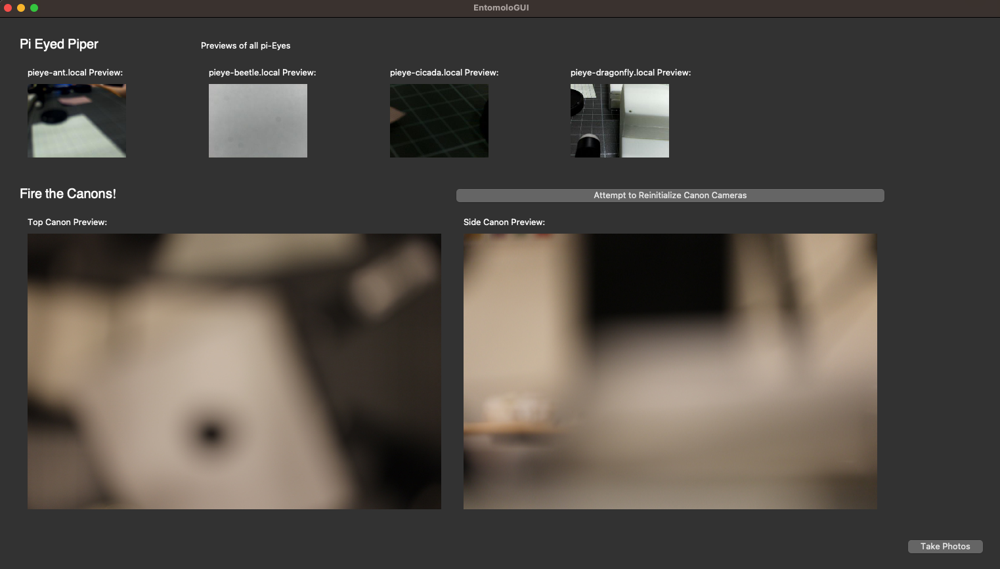

# EntomoloGUI
GUI for interfacing with the Pi-Eyes and Canons for the NHMD Pinned Insect Digitization Station.



## Installation Instructions
It's assumed that this will be installed on a Mac computer. If using another platform, the instructions may need adjustment.

1. Install [homebrew](https://brew.sh/).
2. Install [anaconda/python](https://docs.anaconda.com/anaconda/install/mac-os/).
3. Install git: 
    ```bash
    brew install git
    ```
4. Clone the git repository: 
    ```bash
    git clone https://github.com/NHMDenmark/EntomoloGUI.git
    ```
5. Install python packages from `environment.yml`.
6. Make a storage folder for images and update `STORAGE_PATH` in `guis/settings/settings.py` to point to this folder.
7. On the two Canon cameras:
    - Ensure one has its owner (set on the camera itself) labeled as 'Top' and the other set to 'Side'. This differentiation lets the GUI distinguish between the 'top'/dorsal camera and the side camera.
    - Make sure both cameras are set to never auto turn off (accessible in the camera settings).
    - Ensure both Canon cameras have an SD card inserted for temporary storage.
8. Install and setup the Pi-Eye cameras as per the [instructions](https://github.com/NHMDenmark/Pi-Eye/).


## TODO
1. Package everything into a portable app.
2. Preview Qrunnable workers should be moved to Qthreads, so they can be stopped gracefully. These Qthreads could then control all camera functions (especially for the Canon). This change will make the mutex flags unnecessary.

For additional details and future plans, refer to the [Pinned Insects Workstation Documentation - Status & Future Steps #51](https://github.com/NHMDenmark/Pinned-Insects-workstation/issues/51).
